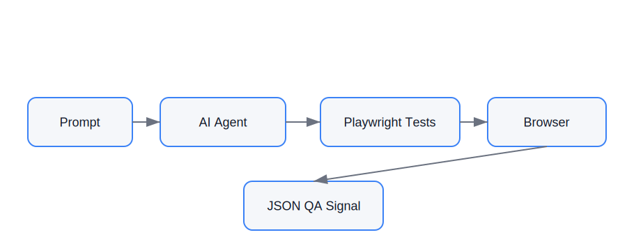

# deterministic-ui-testbed


AI-driven browser automation experiments using **Playwright** and **prompt-driven testing workflows**.

This repository demonstrates how prompts can drive automation workflows that:

1. Generate Playwright tests
2. Execute browser validation
3. Produce deterministic QA signals

The project is intentionally minimal and designed to showcase how **AI-assisted QA automation** can work in practice.

---

# 🚀 What This Project Demonstrates

Two core prompt-driven workflows are explored in this repository.

### Prompt A — Deterministic Smoke Test

Runs a Playwright-based smoke test against a page and returns a strict JSON result describing page health.

Example output:

```json
{
"url":"https://slackdesk.org/index.html",
"ok":true,
"title":"SlackDesk | Open-Source AI Tools for Productivity",
"h1":"Welcome to SlackDesk - Open-Source AI Tools for Productivity 🚀",
"http_status":200,
"final_url":"https://slackdesk.org/index.html",
"dom_ready_ms":350,
"console_errors":0,
"page_errors":0
}
```

---

### Prompt B — Generate Playwright Tests from a User Story

Example prompt:

> "As a visitor I can load the homepage and navigate to the Playground page."

The agent can automatically generate Playwright tests that validate this user story.

These generated tests can then be executed as part of the automation workflow.

---

# 🧭 Architecture

This project demonstrates a prompt-driven browser automation workflow.



The workflow can be summarized as:

```
Prompt
   ↓
AI Agent
   ↓
Playwright Test Generation
   ↓
Browser Automation
   ↓
Deterministic JSON QA Signal
```

---

# 📐 Project Overview

The repository demonstrates a simple automation architecture where prompts can generate and execute UI tests.

### Key Components

| Component        | Purpose                           |
| ---------------- | --------------------------------- |
| Prompts          | Define automation instructions    |
| Playwright tests | Perform browser validation        |
| Fixtures         | Provide deterministic test pages  |
| Smoke pipeline   | Generates structured test results |

### Why This Matters

Traditional UI automation requires engineers to manually write test scripts.

This project explores a workflow where:

• prompts generate test automation
• agents execute Playwright tests
• results are returned as structured QA signals

This enables experimentation with **AI-assisted QA systems**.

---

# 🧩 Test Fixtures

The repository includes **local fixture pages** under `fixtures/slackdesk/`.

These pages provide a simplified representation of SlackDesk pages used for deterministic browser testing.

```
fixtures/
└── slackdesk/
    ├── index.html
    ├── playground.html
    ├── styles.css
    └── assets/
```

### Why fixtures are used

Testing against live websites can introduce instability due to:

* network latency
* production deployments
* third-party scripts
* CDN changes

Using local fixtures makes tests:

* deterministic
* reproducible
* fast
* runnable offline

---

# 🧠 Prompt Examples

## Prompt A — Deterministic Smoke Test

Example prompt:

```
Capability: Smoke a single URL

Goal:
Run a deterministic UI smoke test and return a JSON result.

Steps:
1. Navigate to the page
2. Wait for DOMContentLoaded
3. Capture title and first H1
4. Count console and page errors
5. Return JSON output
```

---

## Prompt B — Generate Tests from a User Story

Example prompt:

```
User Story:
"As a visitor I can load the homepage and navigate to Playground."
```

The agent generates Playwright automation similar to:

```
tests/navigation.spec.ts
```

The generated test verifies:

* homepage loads successfully
* headings are visible
* navigation works correctly

---

# ⚡ Try It in 60 Seconds

Clone the repository and run the tests locally.

```bash
git clone https://github.com/YOURNAME/deterministic-ui-testbed
cd deterministic-ui-testbed

npm install
npx playwright install
npx playwright test
```

---

# 🧪 Run the Smoke Pipeline

Run the deterministic smoke test against a URL.

```bash
./scripts/smoke.sh https://slackdesk.org/index.html
```

Validate the JSON contract:

```bash
./scripts/smoke.sh https://slackdesk.org/index.html | python scripts/smoke-check.py
```

---

# 📂 Project Structure

```
deterministic-ui-testbed
│
├── docs
│   └── architecture.svg
│
├── fixtures
│   └── slackdesk
│
├── prompts
│   ├── prompt-a-smoke-agent.md
│   └── prompt-b-generate-tests.md
│
├── tests
│   ├── smoke.spec.ts
│   └── navigation.spec.ts
│
├── scripts
│   ├── smoke.sh
│   └── smoke-check.py
│
├── playwright.config.ts
├── package.json
└── README.md
```

---

# 🧪 Tech Stack

* Playwright
* Node.js
* Prompt-driven automation workflows
* Deterministic UI testing patterns

---

# 🔬 Experimentation Goals

This repository explores:

* prompt-driven automation
* AI-assisted test generation
* deterministic UI smoke testing
* structured QA signals

---

# 🤝 Contributions

Ideas, improvements, and experiments are welcome.

If you're exploring **AI-assisted testing workflows**, feel free to open an issue or discussion.

---

# ⭐ Support

If you find this project interesting, please consider **starring the repository**.

It helps others discover the work and encourages further experimentation.


