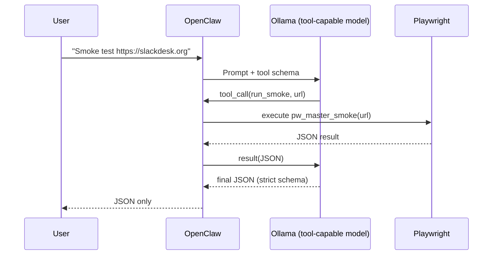

# Interoperability POC (Playwright + OpenClaw + Ollama)

This is the smallest “end-to-end” demo you can point to:

1. **Ollama model** supports tools
2. **OpenClaw** requests a tool call
3. Tool call runs a **Playwright smoke script**
4. Final output is deterministic JSON

## Mermaid flow

## Suggested “master smoke prompt”

Use this verbatim in OpenClaw:

> Smoke test **{URL}**. Return ONLY a single-line JSON object with keys:
> `url, ok, http_status, final_url, title, h1, dom_ready_ms, console_errors, page_errors`.
> No extra text. If any field is missing, set it to null.

## Practical tips

- Set `num_ctx` to a reasonable value (e.g., 16k) to satisfy OpenClaw minimums.
- Keep output small (`num_predict` 256–512).
- Use headless Chromium for speed and reliability.
